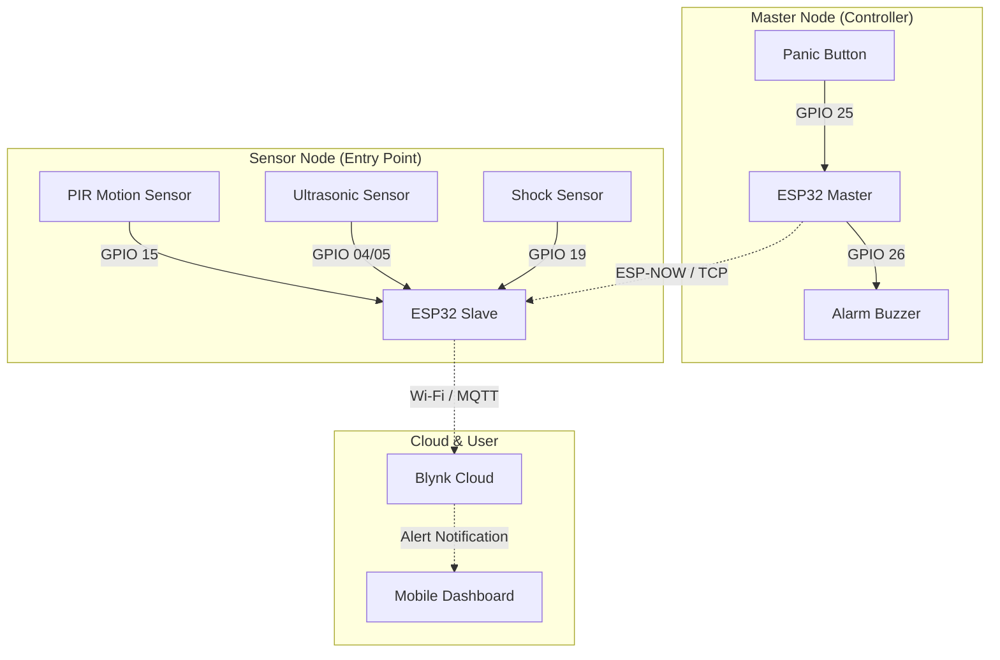

# Smart Home Access & Intrusion Detection System (Dual-Node IoT)

## 📌 Project Overview
This project is a robust security system designed to detect unauthorized entry using a **multi-sensor fusion approach**. Unlike standard systems, this utilizes a **Dual-Node Architecture** (Master & Slave ESP32s) to separate the sensing logic from the control logic, ensuring reliability and coverage.

The system integrates real-time monitoring via the **Blynk IoT Platform**, providing instant alerts for motion, proximity breaches, and physical impact (shock).

## 🛠 Hardware Tech Stack
* **Microcontrollers:** 2x ESP32 (Master Node & Sensor Node).
* **Sensors:**
    * **PIR Motion Sensor:** Detects human presence.
    * **HC-SR04 Ultrasonic Sensor:** Measures proximity distance (< 20cm triggers alert).
    * **Shock/Vibration Sensor:** Detects forced entry attempts (e.g., door banging).
* **Communication:** Wi-Fi (ESP-NOW / TCP-IP) & Blynk Cloud.

## ⚙️ Logic & Architecture
The system operates on a distributed logic model:

### System Architecture Diagram

### 1. The Sensor Node (Slave)
Located at the entry point, this node continuously polls three different data streams:
* **Proximity Logic:** Uses ultrasonic pulses to detect if an object is within 20cm.
    * `if (distance < 20cm) -> Trigger Proximity Alert`
* **Motion Logic:** Passive Infrared (PIR) detection for room occupancy.
* **Vibration Logic:** Digital shock sensor input to detect physical tampering.

All data is pushed to the **Blynk Dashboard** via virtual pins (V0, V3) for remote visualization.

### 2. The Master Node (Controller)
Acts as a central hub/panic button. It maintains a Wi-Fi connection to the slave node and can trigger manual alerts or reset the system state.
* **Debounce Logic:** Implemented software debouncing (50ms) for the manual trigger button to prevent false positives.

## 🚀 How to Run
1.  **Hardware Setup:** Connect sensors to the ESP32 GPIOs as defined in the code (Trig: 4, Echo: 5, PIR: 15, Shock: 19).
2.  **Blynk Config:** Update the `BLYNK_AUTH_TOKEN` in `Sensor_Node.ino`.
3.  **Network:** Ensure both ESP32 modules are on the same 2.4GHz Wi-Fi network.
4.  **Flash:** Upload `Sensor_Node.ino` to the entry-point ESP32 and `Master_Node.ino` to the controller ESP32.

## 📂 Repository Structure
* `/firmware`
    * `Sensor_Node.ino`: Main code handling PIR, Ultrasonic, and Shock sensors.
    * `Master_Node.ino`: Code for the central control unit.
* `/docs`: System diagrams and setup photos.

## 👤 Author
**Kesava Satish Boppana**
